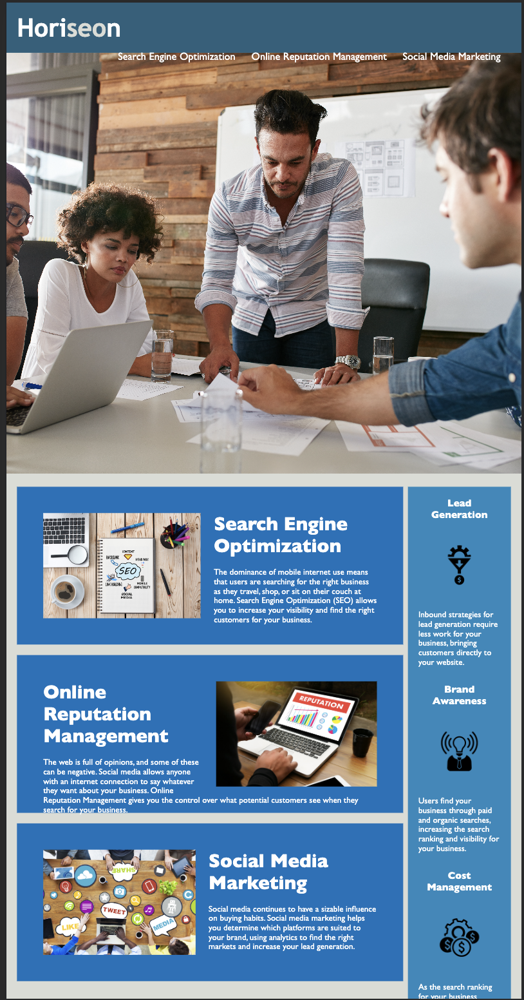

# <Week-1-Horiseon>

## Link
https://nikitaaa95.github.io/Horiseon-Develop-Accessibility/

## Description

The purpose of this project is to take the website as provided by the client's team and make it more accessible. This way the site can be used by all readers/users efficiently. Through updating the existing code, I learned the uses of alt text and the importance of the HTML's semantic structure.

## Installation

N/A

## Usage

Please use this site to better understand how to make your brand stand out and how to utilize the most up to date tools to make your company successful. Feel free to use a screenreader or another accessibility tool to review the site.

## Credits
Tutorials and Aids  used for this project
- https://blog.hubspot.com/marketing/image-alt-text?hubs_content=blog.hubspot.com%2Fwebsite%2Fscreen-reader-accessibility&hubs_content-cta=guide%20to%20image%20alt%20text
- https://www.w3schools.com/html/html5_syntax.asp
- https://bootcampspot.instructure.com/courses/4348/pages/3-dot-5-3-create-a-professional-project-readme?module_item_id=964185
- https://www.freecodecamp.org/news/css-selectors-cheat-sheet-for-beginners/#:~:text=not%20a%20substring.-,Grouping%20CSS%20Selector,elements%20you%20want%20to%20select.

## Website Screenshot

